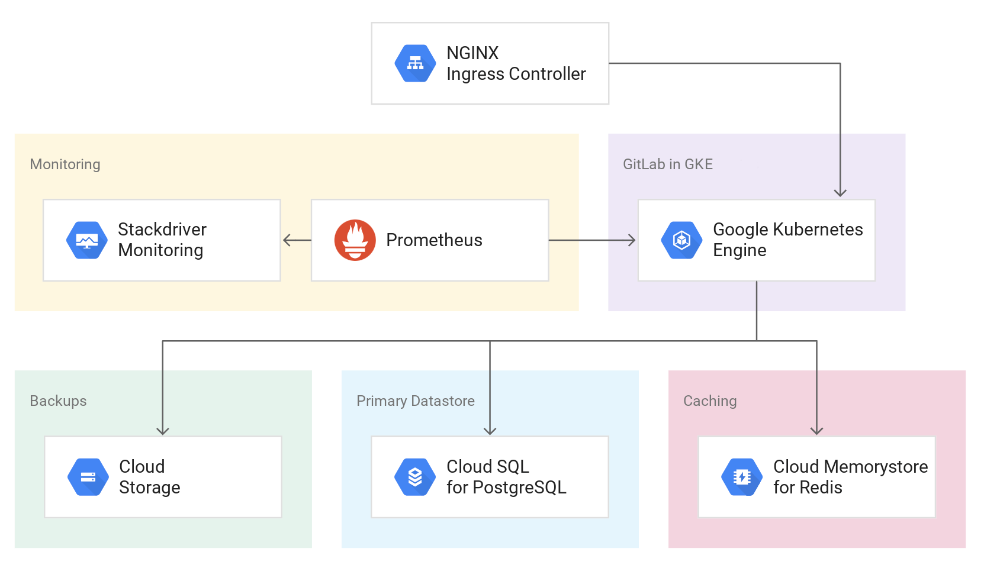

## Deploy Gitlab production grade on GKE
# terraform-google-gke-gitlab

This Terraform configuration creates a scalable, reliable, and observable GitLab instance on Google Kubernetes Engine (GKE)  as the computing environment and the following services for storing
data:
- CloudSQL for PostgreSQL
- Memorystore for Redis
- Cloud Storage



## Deployment 

```
module "gitlab" {
  source              = "../modules/gke_gitlab"
  project_id                 = var.project_id
  certmanager_email          = var.certmanager_email
}
```

Then perform the following commands on the root folder:

- `terraform init` to get the plugins
- `terraform plan` to see the infrastructure plan
- `terraform apply` to apply the infrastructure build


[^]: (autogen_docs_start)

## Inputs

| Name | Description | Type | Default | Required |
|------|-------------|:----:|:-----:|:-----:|
| certmanager\_email | Email used to retrieve SSL certificates from Let's Encrypt | string | n/a | yes |
| gitlab\_db\_password | Password for the GitLab Postgres user | string | `""` | no |
| project\_id | GCP Project to deploy resources | string | n/a | yes |
| region | GCP region to deploy resources to | string | `"us-central1"` | no |

## Outputs

| Name | Description |
|------|-------------|
| gitlab\_url | URL where you can access your GitLab instance |
| root\_password\_instructions | Instructions for getting the root user's password for initial setup |

[^]: (autogen_docs_end)


### Software Dependencies
### Terraform
- [Terraform](https://www.terraform.io/downloads.html) 0.12.x
- [terraform-provider-google](https://github.com/terraform-providers/terraform-provider-google) plugin v1.8.0

### Configure a Service Account
In order to execute this module you must have a Service Account with the
following project roles:
- roles/owner

## Install

### Terraform
Be sure you have the correct Terraform version (0.12.x), you can choose the binary here:
- https://releases.hashicorp.com/terraform/

## File structure
The project has the following folders and files:

1. /deployment: Terraform deployment execution
2. main.tf: main file for this module, contains all the resources to create
3. variables.tf: all the variables for the module
4. output.tf: the outputs of the module
5. providers.tf: project providers (gcp, kubernetes, helm)
6. versions.tf: required versions
7. /values.yaml.tpl: Helm values. Learn more about values in helm


